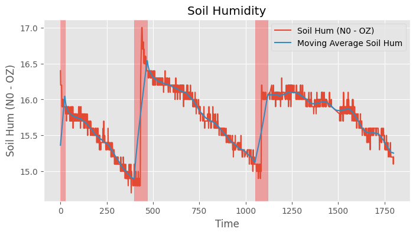
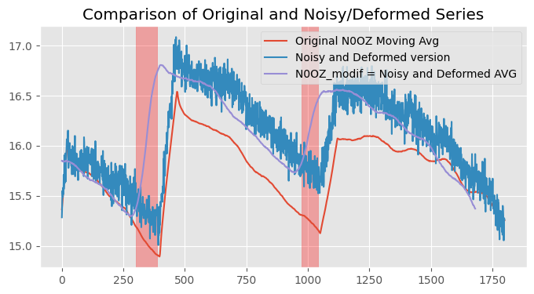
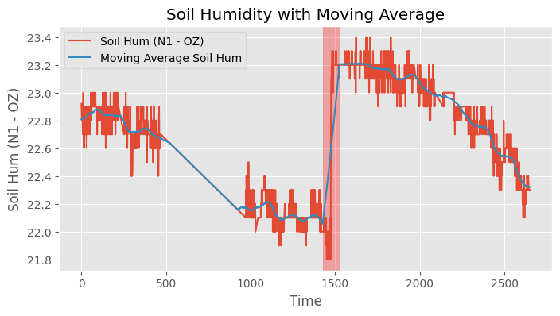
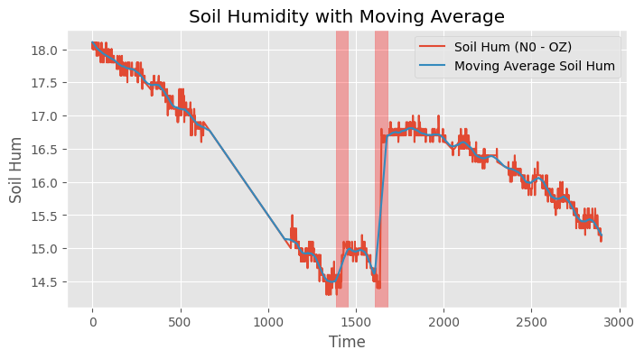

# Agricultural Time Series Prediction using LSTM and Federated Learning

## Overview

This project focuses on developing an LSTM model for time series prediction of soil humidity, leveraging a Hierarchical Federated Learning (HFL) framework. The goal is to predict future soil conditions for more effective agricultural decision-making.

## Data

<table>
  <tr>
    <td></td>
    <td></td>
  </tr>
  <tr>
    <td></td>
    <td></td>
  </tr>
</table>

- **Source**: Real-world agricultural sensor data (soil humidity), from the the partnership grant between __University of Newcastle__ and __University of Waikato__.
- **Challenges**: Small datasets, missing values, and noise.
- **Preprocessing**: 
  - Suppression of peak and zero values.
  - Rolling average to reduce noise.
  - Interpolation for missing data.
  - Feature engineering to detect when crops are watered.

## Model Architecture

The model architecture was fine-tuned to achieve the best results, with key hyperparameters being:

- **Batch Size**: 64
- **Optimizer**: Adam
- **Learning Rate**: 0.005
- **Loss Function**: Mean Squared Error (MSE)
- **Variable Hyperparameters**: 
  - Number of layers (`num_layers`)
  - Units per layer (`num_units`)
  - Number of input time steps (`n_step_in`)
 

## Federated Learning (HFL) Implementation

This project integrates **Flower**, a federated learning framework, to facilitate training across multiple clients and servers:

- **Local Models**: Each client trains a model on their local data.
- **Local Servers**: Aggregate models from clients within the server’s scope. Client 0 and 1 for Local Server 1 (LS1) and Client 2 and 3 for Local Server 2 (LS2)
- **Global Server**: Aggregates local server models to produce a global model.

### Results:

- **Local Model Performance**: Local models suffered from lack of data, but served as useful benchmarks.
- **Global Model**: Significant improvement in performance when aggregating across clients and servers.

## References

- [Flower Federated Learning Framework](https://flower.dev/)
- LSTM architecture inspired by [TensorFlow Sunspots CNN-RNN-DNN Lab](https://github.com/https-deeplearning-ai/tensorflow-1-public/blob/main/C4/W4/ungraded_labs/C4_W4_Lab_3_Sunspots_CNN_RNN_DNN.ipynb)
